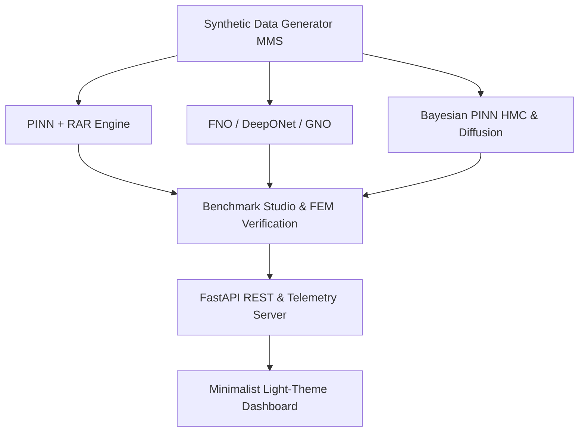

# Neural PDE Bench Architecture

## System Overview
`neural-pde-bench` is a high-performance Scientific Machine Learning (SciML) platform bridging physics-informed neural networks (PINNs) and geometry-aware operator learning (FNO, DeepONet, GNO) with Bayesian UQ and generative score-based diffusion models.

## Key SciML Components
1. **PINN + RAR:** Physics-Informed Neural Network with automatic differentiation residual loss ($u_t - \alpha u_{xx}$) and dynamic collocation refinement (RAR).
2. **XPINN Domain Decomposition:** Splits complex spatial domains into non-overlapping subdomains with interface value ($u_1 = u_2$) and flux ($\nabla u_1 = \nabla u_2$) penalty constraints.
3. **FNO (Fourier Neural Operator):** Parameterizes integral kernel in Fourier domain using truncated spectral convolutions.
4. **DeepONet:** Dual Branch-Trunk network learning nonlinear continuous operators between function spaces.
5. **GNO (Graph Neural Operator):** Message-passing graph neural network for arbitrary boundary shapes (L-shape, circular holes).
6. **Diffusion Inverse Sampler:** Generative score-based sampler validated against Hamiltonian Monte Carlo (HMC) posterior chains.
